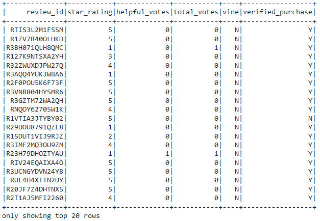
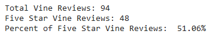
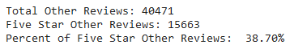

# Amazon Vine Analysis with AWS and PySpark

## Overview of the Analysis - Purpose

The Amazon Vine program is a service that allows manufacturers and publishers to receive reviews for their products. Companies pay a small fee to Amazon and provide products to be reviewed by Amazon Vine members. Our goal is to perform ETL using AWS and PySpark to get a video game review dataset into pgAdmin. Then we will perform an analysis to determine if there is any bias towards favorable reviews from Vine members. With this information, we'll report our analysis back to Jennifer so she can submit it to the SellBy stakeholders. 

## Results

How many Vine reviews and non-Vine reviews were there?
  - There were 94 total Vine reviews and 40471 non-Vine reviews.
  
How many Vine reviews were 5 stars? How many non-Vine reviews were 5 stars?
  - 48 of the Vine reviews were 5 stars, and 15663 of the non-Vine reviews were 5 stars. 
  
What percentage of Vine reviews were 5 stars? What percentage of non-Vine reviews were 5 stars?
  - Of the Vine reviews, 51.06% were 5 stars, and of the non-Vine reviews, 38.70% were 5 stars. 

## Summary
